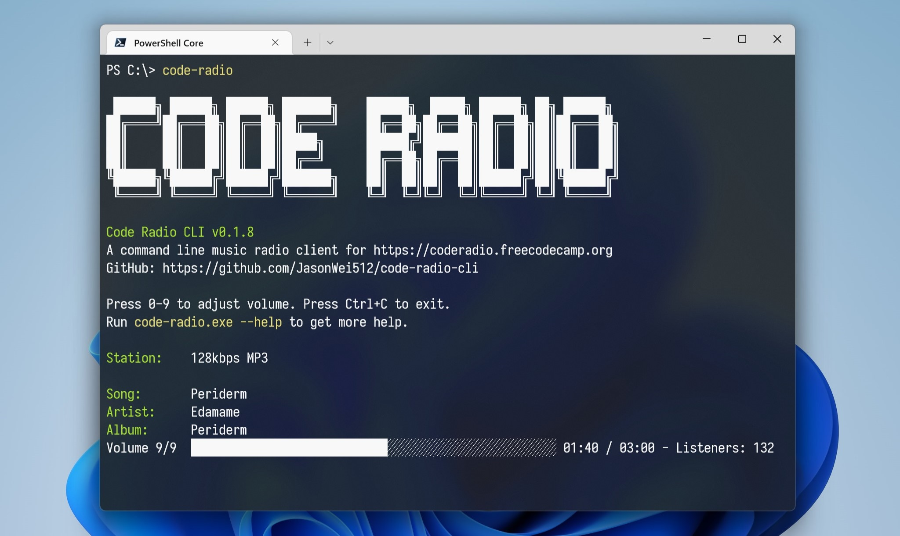

# Code Radio CLI

[](https://crates.io/crates/code-radio-cli)
[](https://github.com/JasonWei512/code-radio-cli/releases)

🎵 24/7 music designed for coding, now in your terminal!

A command line music radio client for https://coderadio.freecodecamp.org ([about](https://www.freecodecamp.org/news/code-radio-24-7/)), written in Rust.



## Install

- Download prebuilt binary from [GitHub release page](https://github.com/JasonWei512/code-radio-cli/releases).
  
- 🪟 On Windows, install with [WinGet](https://github.com/microsoft/winget-cli):
  
  ```
  winget install code-radio-cli
  ```

- 🦀 Install with [Cargo](https://rustup.rs/):
  
  ```
  cargo install code-radio-cli
  ```

  After installation, run `code-radio` in command line to start. You may need to restart your shell first.

### ⚠ About building and running on Linux 🐧

This program uses [rustaudio/cpal](https://github.com/rustaudio/cpal) lib to play audio, which requires ALSA development files on Linux.

In order to build and run this program on Linux, you need to install：

- `libasound2-dev` on Debian / Ubuntu
- `alsa-lib-devel` on Fedora

## Usage

```
code-radio [OPTIONS]

OPTIONS:
    -h, --help                 Print help information
    -l, --list-stations        List all stations
    -n, --no-logo              Do not display logo
    -s, --station <STATION>    The ID of the station to play from
    -v, --volume <VOLUME>      Volume, between 0 and 9 [default: 9]
    -V, --version              Print version information
```
